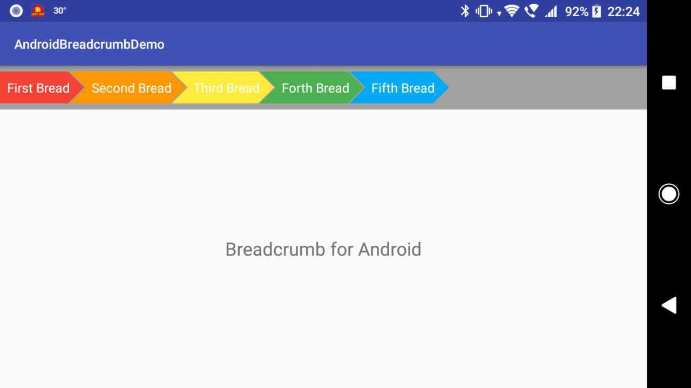

# Android Breadcrumb Textview
A small factory for producing Breadcrumbs Textview in Android
100% Kotlin support



## Usage
Its strongly recommended to use with `HorizontalScrollview` and `LinearLayout` to get best performance on displaying crumbs

## Adding Breadcrumbs
This simple factory was designed to produce `TextView` which have a breadcrumb background,
its easy to modify and adding your personal style like colors, text size etc.

```kotlin
  linearLayout.addView(
                    BreadCrumbFactrory(context = this)
                            .setTitle("First Bread")
                            .setBreadCrumbColor("#800080")
                            .setStartEdgeOpen(false)
                            .setEndEdgeOpen(true)
                            .make()
            )
 ```
 
 ### Factory Methods
 Its easy to add your custom modifications to the breadcrumbs as its Textview based.
 Some of the basic methods of the factory are:
 
 `.setTitle(String)`
 set the text of the breadcrumb
 
 `.setBreadCrumbColor(String)`
 set breadcrumb color (HEX color string)
 
 `setStartEdgeOpen(Boolean)`
 tell breadcrumb draw `>` shape on left (start) side or draw a `|`
 
 `setEndEdgeOpen(Boolean)`
 tell breadcrumb draw `>` shape on right (end) side or draw a `|`
 
 ### Special Thanks
 This repo was inspired by https://github.com/worldline-spain/breadcrumbview, 
 thanks for creating the breadcrumb drawable!
 
 Feel free to improve my code through submitting pull requests! :D
